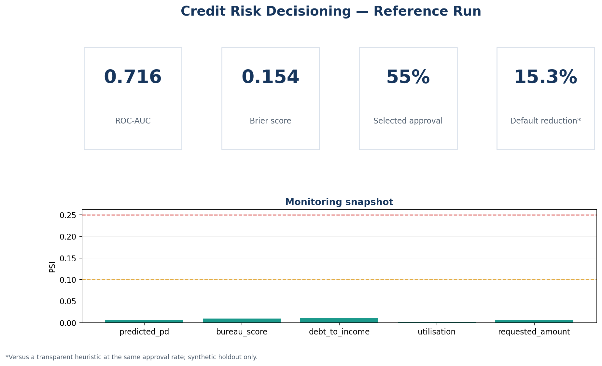

# Credit Risk Decisioning

[](https://github.com/Ali-Mattar-code/credit-risk-decisioning/actions/workflows/ci.yml)
[](https://www.python.org/)
[](LICENSE)

An auditable probability-of-default system that connects model quality to lending decisions. It trains a champion–challenger pair, calibrates probabilities on a separate chronological window, selects an approval policy under a risk constraint, and produces drift and group diagnostics for monitoring.

> **Evidence boundary:** every metric below comes from the committed synthetic-data generator and an out-of-time holdout. This is a clean-room portfolio reconstruction inspired by an earlier credit-risk modelling exercise. It contains no employer code, customer records or production results.



## Reference result

The deterministic reference run uses 15,000 synthetic applications: 9,750 for development, 2,250 for calibration and 3,000 for a final out-of-time holdout.

| Measure | Reference result | Why it matters |
|---|---:|---|
| Champion | Calibrated logistic regression | Transparent benchmark selected before holdout review |
| Holdout ROC-AUC | **0.716** | Ranking quality on the later time window |
| Holdout Brier score | **0.154** | Accuracy of the predicted probabilities |
| Expected calibration error | **0.041** | Gap between predicted and observed risk |
| Default reduction at 60% approvals | **15.3%** | Versus a disclosed bureau heuristic, at equal volume |
| Selected policy | **55% approval rate** | Highest expected profit subject to mean approved PD ≤ 12% |

These are demonstration results on synthetic data, not estimates of real-world lender performance. Exact values are stored in [`results/reference/metrics.json`](results/reference/metrics.json) and regenerated in CI.

## System design


The design deliberately separates three questions that are often collapsed into one notebook:

1. **Can the model rank risk?** ROC-AUC, average precision and KS.
2. **Can its scores be treated as probabilities?** Brier score, log loss, decile calibration and ECE.
3. **What decision should the lender make?** Approval volume, predicted/observed loss and transparent unit economics.

## What is implemented

- Deterministic synthetic portfolio generator with nonlinear credit risk and late-period drift
- Leakage-safe development, calibration and out-of-time holdout windows
- Logistic-regression champion and histogram-gradient-boosting challenger
- Isotonic calibration fitted only on the calibration window
- Exact-volume, risk-ranked approval policies and a constrained policy frontier
- Equal-approval comparison against a transparent bureau heuristic
- PSI monitoring for scores and major features
- Diagnostic approval-rate audit by age group; age is excluded from model inputs
- FastAPI scoring endpoint, Streamlit review dashboard, typed package and CLI
- Tests, static checks, Docker packaging and GitHub Actions CI

## Reproduce it

```bash
git clone https://github.com/Ali-Mattar-code/credit-risk-decisioning.git
cd credit-risk-decisioning
python -m venv .venv
source .venv/bin/activate  # Windows: .venv\Scripts\activate
python -m pip install -e ".[dev,app]"
credit-risk reproduce
pytest
```

The command rewrites the reference tables and figures from seed `42`:

```text
results/reference/
├── calibration_by_decile.csv
├── drift_report.csv
├── group_audit.csv
├── metrics.json
├── policy_frontier.csv
└── figures/
```

Run the interactive review surface:

```bash
streamlit run app/dashboard.py
```

Train an artifact and start the scoring API:

```bash
credit-risk reproduce --model artifacts/champion.joblib
uvicorn credit_risk.api:app --reload
```

```bash
curl -X POST http://localhost:8000/score \
  -H "Content-Type: application/json" \
  -d '{
    "annual_income": 62000,
    "requested_amount": 12000,
    "term_months": 36,
    "interest_rate": 0.12,
    "debt_to_income": 0.31,
    "utilisation": 0.42,
    "bureau_score": 704,
    "previous_delinquencies": 0,
    "credit_history_months": 96,
    "employment_length_years": 5,
    "open_accounts": 7,
    "purpose": "home_improvement",
    "channel": "direct"
  }'
```

## Decisions and safeguards

| Risk | Control in this repository |
|---|---|
| Data leakage | All transformations are fitted inside model pipelines after a chronological split |
| Misleading accuracy | Ranking, probability and policy metrics replace headline accuracy |
| Poorly calibrated PDs | Isotonic calibration uses a dedicated window that is separate from development and holdout |
| Volume–risk confusion | Comparisons hold approval rate constant |
| Model drift | PSI is calculated for predicted PD and major drivers |
| Sensitive attributes | Age group is excluded from training and retained only for diagnostic monitoring |
| Metric overclaiming | Every output is labelled synthetic; no result is presented as production evidence |

More detail is available in the [methodology](docs/methodology.md), [model card](docs/model_card.md), [data card](docs/data_card.md) and [engineering decisions](docs/engineering_decisions.md).

## Repository map

```text
src/credit_risk/       modelling, calibration, policy and monitoring package
app/dashboard.py       interactive evidence review
tests/                 unit and end-to-end tests
docs/                  methodology, provenance and governance notes
results/reference/     reproducible tables and figures
.github/workflows/     automated quality and reproduction checks
```

## Scope

This software is educational and is not a lending recommendation, regulatory assessment or production credit policy. A real deployment would additionally require representative data, legal and compliance review, outcome maturity controls, reject-inference analysis, independent validation and ongoing governance.

## Author

[Ali Mattar](https://www.linkedin.com/in/ali-mattar/) · [GitHub](https://github.com/Ali-Mattar-code)
